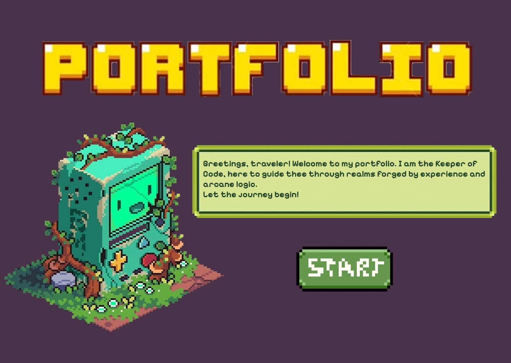

# 🎮 Maryam Irshad's Portfolio

_A miniguide for navigating the precarious realms of my software journey._

## 🧩 About

This is my personal **React-based portfolio web app**, crafted with a retro 90s **pixel-game design aesthetic** to showcase my **skills, education**, and **projects** in an interactive and stylish way.

---

## 🛠️ Built With

- **React JS**
- **JavaScript**
- **Custom CSS** 
- **Manual routing with `react-router-dom`**
- **Fully self-designed graphics and layout**

---

## 🚪 App Flow

- **Start Screen** ➝ Click "Start" button
- **Menu Page** ➝ Choose between `About`, `Education`, `Skills & Projects`

## 🧠 Thought Process

I wanted to build something that’s:

- ✨ Aesthetic (whats more in then retro?)
- 🎓 Informative (easy to navigate and give you the things you are looking for)
